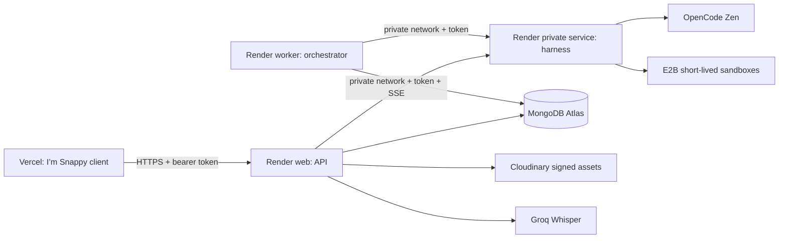

# I’m Snappy Cloud-Agent Platform

I’m Snappy is a deployable cloud-agent workspace with a React/Vite browser client, a public API, a private execution harness, and a durable schedule worker. The public UI runs on Vercel. The three server processes run independently on Render, while MongoDB Atlas, Cloudinary, Groq Whisper, OpenCode Zen, and E2B provide persistence and specialist capabilities.

> **Security boundary.** Browser code holds only a short-lived authenticated session. Provider credentials, Cloudinary signing secrets, the MongoDB URI, E2B sandbox identifiers, and service-to-service tokens remain server-side. The API encrypts user-supplied provider credentials before persistence.

## Repository layout

```text
imsnappy/
├── client/                  # One Vercel project: browser application
├── services/
│   ├── api/                 # One Render Web Service: public API
│   ├── harness/             # One Render Private Service: OpenCode + E2B execution
│   └── orchestrator/        # One Render Background Worker: durable schedules
├── packages/contracts/      # Shared TypeScript request and stream types
├── render.yaml              # Blueprint that provisions the three Render projects
└── README.md                # Environment handoff and production smoke test
```

The client and every server process are deliberately isolated so that each can be deployed, restarted, and scaled independently. See [`services/README.md`](./services/README.md) for the per-service project map, then use the deployment steps below to connect them through the public API and Render private network.

## Service topology



| Component | Deployment | Responsibility | Inbound access |
| --- | --- | --- | --- |
| `client/` | Vercel static project | Workspace, account session, streamed chat, Library, Settings, and schedules | Public HTTPS |
| `services/api/` | Render web service | Auth, MongoDB records, encrypted provider settings, asset signing, transcription, SSE replay | Public HTTPS |
| `services/harness/` | Render private service | Model streaming, policy-governed tool calls, short-lived E2B execution | Render private network only |
| `services/orchestrator/` | Render worker | Schedule leases, idempotency, retry/backoff, run dispatch | No inbound traffic |

Render private services and background workers should be in the same Render workspace and region. The worker can initiate private requests, while the harness is intentionally private and accepts no internet traffic.[1] Vercel should be configured with `client/` as the project Root Directory, where `client/vercel.json` configures the static Vite build and SPA fallback.[2] [3]

## Before deployment

Create fresh production credentials. **Do not reuse the temporary credentials previously used during development.** Store every secret exclusively in the hosting provider’s encrypted environment-variable controls; `.env.example` is documentation only and must never be copied into version control.

| Dependency | Needed by | Required action |
| --- | --- | --- |
| MongoDB Atlas | API and worker | Create a least-privilege database user for database `imsnappy`; configure Atlas network access for the Render services before adding the connection URI. |
| OpenCode Zen | Harness | Create an OpenCode key and choose an available model identifier. |
| E2B | Harness | Create an E2B key; the harness creates and destroys sandboxes per approved tool request. |
| Cloudinary | API | Create a restricted API key/secret for signed uploads. The secret is not delivered to the browser. |
| Groq | API | Create a server-side key for Whisper transcription. |
| Vercel | Client | Create an environment variable named `VITE_API_BASE_URL` containing the public API URL. |

## Deploy the backend on Render

Create a new Render Blueprint from this Git repository and select `render.yaml`. The Blueprint declares one web service, one private service, and one worker. Set all three to the same region; the included manifest uses Singapore as a sensible default for this project’s intended audience, but any single Render region is valid.

After the first provisioned deploy, open the harness service’s **Connect** menu and copy its internal service address. Prefix it with `http://` and use it for `HARNESS_BASE_URL` on both the API and the worker, for example `http://internal-harness-address:4200`. Render supplies this address specifically for private-network connections, and the stable hostname should be used instead of a direct IP.[1]

Set these environment variables in the Render dashboard. Values marked **same** must be exactly identical across the named services.

| Environment variable | API | Harness | Worker | Notes |
| --- | ---:| ---:| ---:| --- |
| `MONGODB_URI` | Required | — | Required | Atlas URI; use the same `imsnappy` database. |
| `MONGODB_DB_NAME` | Optional | — | Optional | Defaults to `imsnappy`. |
| `INTERNAL_SERVICE_TOKEN` | Required | **same** | **same** | Generate a random value of at least 32 characters. |
| `HARNESS_BASE_URL` | Required | — | Required | Internal URL from the harness Connect menu. |
| `CLIENT_ORIGIN` | Required | — | — | Exact Vercel production URL, with no trailing path. |
| `JWT_ACCESS_SECRET` / `JWT_REFRESH_SECRET` | Required | — | — | Two different long random values. |
| `CONFIG_ENCRYPTION_KEY` | Required | — | — | A base64-encoded, 32-byte key. |
| `CLOUDINARY_*` and `GROQ_API_KEY` | Required | — | — | API-only integration secrets. |
| `OPENCODE_API_KEY` and `E2B_API_KEY` | — | Required | — | Harness-only integration secrets. |

The Blueprint deliberately marks secret values as dashboard inputs. Render supports `sync: false` for values that must be entered privately, and generated values for server-only secrets.[4] Never place actual values in `render.yaml`.

### Deploy the client on Vercel

Create a Vercel project from this repository and set its **Root Directory** to `client`. Vercel supports deploying a distinct project from a pnpm monorepo directory, while retaining the root workspace lockfile and dependency graph.[3]

Set `VITE_API_BASE_URL` to the public Render API URL, such as `https://imsnappy-api.onrender.com`. Deploy once, copy the resulting Vercel URL, and set that exact URL as `CLIENT_ORIGIN` in the API service. Redeploy the API after changing the CORS origin. This two-step setup ensures the browser can reach the API without making the private harness public.

## Verification and operation

Run the local validation suite before any commit or production rollout:

```bash
pnpm install --frozen-lockfile
pnpm verify
pnpm build
```

After deployment, validate the public API health endpoint and then exercise the application with a dedicated non-production account.

```bash
curl --fail https://YOUR_API_HOST/health
```

The functional smoke path is: register, save an OpenCode provider configuration, create a conversation, send a short prompt, confirm SSE deltas arrive, upload a small file to Library, create a one-time schedule five or more minutes ahead, and confirm that its run is persisted. Observe API, harness, and worker logs for the same request ID when troubleshooting.

| Signal | Healthy expectation | First response if unhealthy |
| --- | --- | --- |
| API `/health` | HTTP 200 | Confirm API env validation and MongoDB Atlas network access. |
| Streamed run | `run.started`, one or more `run.delta`, then terminal event | Confirm the API and harness share `INTERNAL_SERVICE_TOKEN` and `HARNESS_BASE_URL` is private-network reachable. |
| Tool request | Approval event for non-allowlisted action; E2B lifecycle trace for approved execution | Confirm `E2B_API_KEY`, execution limits, and tool policy. |
| Uploaded asset | Cloudinary URL plus persisted Library row | Confirm Cloudinary credentials, signing configuration, and API log errors. |
| Scheduled task | Worker claims a lease and emits a persisted run | Confirm worker is running, then review its MongoDB connectivity and `nextRunAt`. |

## Repository scripts

| Command | Purpose |
| --- | --- |
| `pnpm check` | Typecheck all workspace packages. |
| `pnpm test` | Run unit tests where supplied. |
| `pnpm verify` | Run typechecks followed by unit tests. |
| `pnpm build` | Build the client, contracts, API, harness, and worker. |
| `pnpm dev:api` / `dev:harness` / `dev:orchestrator` | Run one backend process locally. |

## References

[1]: https://render.com/docs/private-network "Render Private Network"
[2]: https://render.com/docs/private-services "Render Private Services"
[3]: https://vercel.com/docs/monorepos "Vercel: Using Monorepos"
[4]: https://render.com/docs/blueprint-spec "Render Blueprint YAML Reference"
