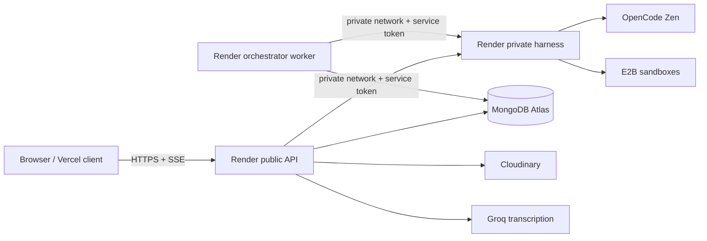

# Architecture

## The intentional two-runtime model

I’m Snappy currently has two aligned but distinct implementations. This is an architectural decision, not an accidental duplication.

| Dimension | Local full-stack workspace | Deployable cloud monorepo |
| --- | --- | --- |
| Path | `/home/ubuntu/agentelier` | `/home/ubuntu/imsnappy-staging` |
| Goal | Verify real interactive behavior in Manus. | Deploy independently scalable services. |
| Client | React 19, Vite, Tailwind 4, Wouter. | React/Vite client in `client/`. |
| Server shape | One Express process with tRPC plus special SSE/upload routes. | Public API, private harness, and background worker. |
| User identity | Manus OAuth context. | API-managed access/refresh tokens in planned deployment model. |
| Persistence | MySQL/Drizzle plus localStorage fallback. | MongoDB Atlas. |
| Asset bytes | Manus built-in S3 storage. | Cloudinary. |
| Scheduling | CRUD data only in preview. | Durable lease-based orchestrator. |

The local runtime establishes that the user experience and core integrations can work. The deployment runtime establishes a safer operational boundary: the browser reaches only the public API; the API and worker reach a private harness; secrets remain server-side.

## Local preview topology

```mermaid
flowchart LR
  Browser[React browser client] -->|tRPC| Express[Express + tRPC server]
  Browser -->|POST SSE| Chat[/api/chat/stream]
  Browser -->|base64 upload| Upload[/api/library/upload]
  Express --> MySQL[(MySQL via Drizzle)]
  Upload --> S3[Manus S3 storage]
  Chat --> Zen[OpenCode Zen]
  Chat --> Agent[server/agent.ts]
  Agent --> E2B[Short-lived E2B sandbox]
```

### Local request paths

| Flow | Entry point | Owner | Important constraint |
| --- | --- | --- | --- |
| Preferences, schedules, Library metadata | `/api/trpc` | `server/routers.ts` + `server/db.ts` | Signed-in users persist to MySQL; anonymous users receive empty/null API results and the UI falls back to localStorage. |
| Agent chat | `POST /api/chat/stream` | `server/chat.ts` + `server/agent.ts` | SSE is a custom Express route because this preview uses streaming outside standard tRPC calls. |
| File bytes | `POST /api/library/upload` | `server/library.ts` | Request sends base64; server stores bytes using `storagePut`, then the client saves metadata through tRPC. |
| OAuth and system services | `/api/oauth/*`, framework routes | `server/_core/*` | Framework-managed; do not modify casually. |

## Deployable cloud topology



The external architecture intentionally prevents browser access to model-provider keys, sandbox IDs, database credentials, Cloudinary secrets, and service tokens. The API is the public ownership and redaction boundary; the harness is the private execution boundary; the worker is the durability and retry boundary.

## Boundaries and responsibilities

| Component | Owns | Must not own |
| --- | --- | --- |
| Browser client | Rendering, optimistic UI, local drafts, SSE display. | Provider secrets, direct E2B access, database access, long-running jobs. |
| Local Express server | MySQL CRUD, managed storage bridge, local SSE gateway. | Production-scale scheduling or a public production secret-vault. |
| Deployable API | Auth, ownership checks, records, redaction, upload/transcription intent, SSE relay. | Direct browser-visible sandbox execution. |
| Deployable harness | Model routing, tool policy, sandbox lifecycle, normalized events. | Public inbound traffic and browser sessions. |
| Deployable orchestrator | Lease claiming, idempotency, retry/backoff, scheduled dispatch. | User-facing HTTP traffic. |

## Design rules for future work

1. Select the runtime target before coding. If behavior must exist in both, make the parity plan explicit and test each target independently.
2. Keep browser-to-server surfaces narrow and typed. Use tRPC for standard local CRUD and SSE only for progressive run events.
3. Keep external deployment services independently deployable. Do not collapse the private harness or worker into the public API merely for convenience.
4. Persist bytes in object storage and metadata in a database. Do not add large blobs to relational or MongoDB records.
5. Route every new durable architecture choice through [`DECISIONS.md`](DECISIONS.md).

## References

[1]: [Local server entry point](../server/_core/index.ts)
[2]: [Local service router](../server/routers.ts)
[3]: [Deployable service contracts](../../imsnappy-staging/docs/service-contracts.md)
[4]: [Deployable platform runbook](../../imsnappy-staging/README.md)
