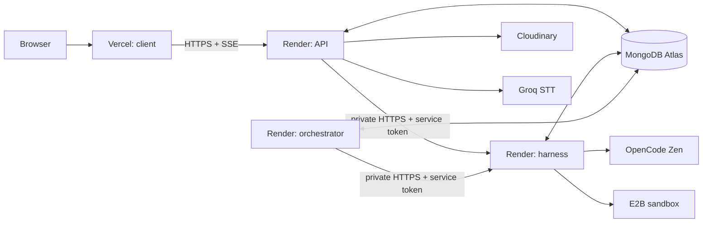

# I’m Snappy Cloud-Agent Platform PRD

**Author:** Manus AI  
**Status:** Implementation baseline  
**Version:** 0.1  
**Date:** 16 August 2026

## Product intent

I’m Snappy evolves from a local visual prototype into a multi-service cloud-agent workspace. A user can chat with an agent, choose a model provider, authorize constrained tool work, retrieve all generated assets from a Library, and schedule a task for later execution. The system is deliberately decomposed so browser traffic, model/tool execution, and background scheduling do not compete for one runtime.

> **Design principle:** The browser is a user interface, not a trusted execution environment. Credentials, tool execution, model calls, storage mutations, and schedule execution remain server-side.

## Scope and first-release boundaries

The first implementation delivers user accounts, configurable model credentials, durable conversations, streamed assistant responses, task/tool traces, file ingestion, artifact library metadata, voice transcription, and scheduled task records. It also establishes the agent-harness and orchestration interfaces that will support additional skills, MCPs, and connectors.

The first release does **not** promise autonomous destructive actions, arbitrary unbounded shell access, unrestricted external connectors, or production-grade billing. Tool execution is explicitly permissioned, audit-recorded, task-scoped, and runs in an ephemeral E2B sandbox. Schedules are durable but initially trigger only the implemented agent workflow.

## Deployment topology

| Service | Deployment target | Public reachability | Primary responsibility | Scale boundary |
|---|---|---:|---|---|
| `client/` | Vercel project | Public | React user interface, streaming display, local drafting | Static and edge-served interface |
| `services/api/` | Render web service | Public | Auth, user data, API gateway, SSE proxy, artifact signing | Scales independently of tool work |
| `services/harness/` | Render private service | Private | Model routing, run loop, tool policy, E2B management | Isolates model and sandbox pressure |
| `services/orchestrator/` | Render background worker | Private / no inbound traffic | Schedule scanning, durable jobs, retries, notification events | Separates long-running background work |
| MongoDB Atlas | Managed database | Private credential access | Durable state, records, leases, audit history | System of record |
| Cloudinary | Managed asset store | Signed/server initiated | Asset bytes, previews, delivery transforms | Large-object boundary |
| E2B | Managed sandbox provider | Server API only | Isolated task execution | Per-run elastic sandbox capacity |

Vercel permits a selected monorepo directory to deploy as an independent project; the frontend therefore deploys from `client/` only.[1] Render can deploy each directory of a monorepo as a separate service and use root directories or build filters to avoid unrelated redeploys.[2] The harness is a Render private service—unreachable from the public internet but reachable by the API over Render’s private network—while orchestration is a background worker that receives work from durable storage/queues rather than inbound browser requests.[3] [4]

## Core user workflows

### Chat and agent run

The client creates a conversation or appends a message through the API. The API writes a pending run and message transactionally, validates the selected user provider configuration, and opens an SSE response. It invokes the private harness with an internal service token and run context. The harness streams normalized events—text delta, reasoning summary, tool request, tool result, artifact, and terminal state—to the API, and the API forwards only the user-authorized events to the browser while persisting an audit trail. The final assistant message and run terminal state are committed before SSE closes.

### Sandbox tool execution

The harness converts an approved tool request into a limited execution plan. It creates an E2B sandbox, records the sandbox linkage without exposing an ID or capability to the browser, executes only an allow-listed command through the SDK, collects bounded logs and artifacts, and kills the sandbox in `finally`. E2B’s JavaScript SDK supports `Sandbox.create()` and `sandbox.commands.run(...)`; the platform keeps those calls behind the private harness boundary.[5]

### Library asset lifecycle

Uploads are requested from the API. The API validates intent and MIME type, then either issues a short-lived signed upload parameter set or performs a server-side upload. Cloudinary stores bytes and derivatives; MongoDB stores ownership, task provenance, type, visibility, and deletion state. Cloudinary states that its API secret must not be present in client-side code, so the design keeps the secret in Render’s service environment only.[6]

### Scheduling

The API validates an IANA timezone and cron-like schedule, then persists a schedule with a `nextRunAt` date. The orchestrator claims due schedules through an atomic lease, creates an idempotent job, calls the private harness, records retries with exponential backoff, and calculates the next due time. The worker uses `leaseExpiresAt` to recover work after restart. A later scale-out configuration may add a Redis-compatible queue; the first version remains correct with MongoDB leases and idempotency keys.

## Data model

| Collection | Purpose | Required indexes |
|---|---|---|
| `users` | Profile and password hash | unique `email` |
| `providerConfigs` | Encrypted user model credentials and selected model | `{ userId, provider }` unique |
| `conversations` | Workspace threads and titles | `{ userId, updatedAt }` |
| `messages` | Ordered user/assistant/tool messages | `{ conversationId, createdAt }` |
| `runs` | Agent-run state, traces, costs, selected model | `{ userId, status, createdAt }`, `{ conversationId, createdAt }` |
| `artifacts` | Cloudinary-backed Library records | `{ userId, createdAt }`, `{ userId, type, createdAt }` |
| `schedules` | User-managed future agent tasks | `{ enabled, nextRunAt }`, `{ userId, createdAt }` |
| `scheduledJobs` | Idempotent executions and retry/lease state | unique `idempotencyKey`, `{ status, leaseExpiresAt }` |
| `auditEvents` | Security and activity history | `{ userId, createdAt }`, `{ runId, createdAt }` |

All ownership-bound queries filter by `userId` on the server, even when an entity ID is provided. Provider secrets are envelope-encrypted using AES-256-GCM before storage. The encryption key stays only in the API service environment and is rotated through versioned key identifiers.

## API and event contracts

| Surface | Representative route/event | Intent |
|---|---|---|
| Auth | `POST /v1/auth/register`, `POST /v1/auth/login` | Create account or exchange credentials for access/refresh tokens |
| Conversations | `GET/POST /v1/conversations`, `POST /v1/conversations/:id/messages` | Read threads and start a streamed run |
| Run stream | `GET /v1/runs/:id/events` (SSE) | Resume run updates after reconnect |
| Provider settings | `GET/PUT /v1/settings/providers` | Manage encrypted provider profiles without returning secrets |
| Library | `POST /v1/library/uploads/sign`, `GET /v1/library`, `DELETE /v1/library/:id` | Sign uploads and manage artifact records |
| Transcription | `POST /v1/transcriptions` | Queue/perform Groq transcription and create an artifact record |
| Schedules | `GET/POST /v1/schedules`, `PATCH/DELETE /v1/schedules/:id` | Manage scheduled runs |
| Harness internal | `POST /internal/runs`, `POST /internal/runs/:id/cancel` | Private, service-token-protected execution boundary |

The system uses `run.delta`, `run.trace`, `run.artifact`, `run.awaiting_approval`, `run.completed`, `run.failed`, and `run.cancelled` as normalized streaming event types. Browsers receive text and safe trace summaries; sensitive command text, encrypted config, private URLs, sandbox identifiers, and provider error bodies are redacted.

## Provider integration rules

OpenCode Zen offers an OpenAI-compatible chat-completions endpoint at `https://opencode.ai/zen/v1/chat/completions` and a model listing endpoint at `/zen/v1/models`.[7] The harness fetches provider models from the configured provider endpoint, validates the requested identifier against a supported allow-list or current provider list, and stores an opaque model selection reference with each run. No key is ever embedded in a Vite environment variable.

Groq provides OpenAI-compatible audio transcription routes and supports `whisper-large-v3-turbo` and `whisper-large-v3`.[8] Audio that fits the provider limit may be processed directly by the API; large inputs are deferred to a background job or split before transcription. The transcript, timestamp metadata, and source artifact reference are persisted separately.

## Security and operational controls

| Area | Required control |
|---|---|
| Browser boundary | No long-lived provider, storage, sandbox, or database secret in `client/`; allow-listed public API origin only |
| API authentication | Argon2 password hashes, short-lived access JWTs, rotated refresh tokens, rate limits, and strict CORS |
| Service authentication | Dedicated, rotated API-to-harness token; private Render hostname; replay-resistant request IDs |
| Provider keys | AES-GCM encryption at rest; never sent back in an API response; redacted logs |
| Sandbox | Per-run timeout, isolated E2B instance, command/tool allow-list, approval gate for elevated actions, mandatory cleanup |
| Storage | Server-issued signed upload scope, owner-bound asset records, signed/private delivery for non-public files |
| Scheduled jobs | Atomic lease, idempotency key, bounded retries, dead-letter terminal state, audit event per attempt |
| Observability | Correlation ID across API/harness/worker, structured JSON logs, redacted error reporting, health endpoints |

## Delivery milestones

| Milestone | Deliverable | Evidence of completion |
|---|---|---|
| Foundation | Monorepo and shared contracts | Local typecheck and service health checks |
| API | Auth, Mongo persistence, provider config encryption, chat endpoint | Integration tests with mocked harness |
| Harness | OpenCode streaming, normalized events, E2B adapter and approval state | Contract test plus sandbox adapter unit tests |
| Worker | Durable schedule scanning, leases, retries, run dispatch | Deterministic clock-based tests |
| Media | Cloudinary signature path, Library metadata, Groq transcription path | MIME/ownership/security tests |
| Deployment | `render.yaml`, Vercel settings, `.env.example`, README runbook | Independent root-directory builds and deploy instructions |

## Acceptance criteria

The platform is ready for a staged deployment when a user can register, select a model configuration without a secret being returned, create and stream a conversation, inspect a persisted tool trace, upload and list an asset, transcribe an audio artifact, create/pause/delete a schedule, and reconnect to a run stream. Unit and integration tests must demonstrate that ownership checks, secret redaction, service authentication, job idempotency, and sandbox cleanup failures are handled. Git history must contain no API keys, connection strings, or Cloudinary secrets.

## References

[1]: https://vercel.com/docs/monorepos "Vercel: Using Monorepos"
[2]: https://render.com/docs/monorepo-support "Render: Monorepo Support"
[3]: https://render.com/docs/private-services "Render: Private Services"
[4]: https://render.com/docs/background-workers "Render: Background Workers"
[5]: https://e2b.dev/docs/commands "E2B: Running Commands in a Sandbox"
[6]: https://cloudinary.com/documentation/image_upload_api_reference "Cloudinary: Upload API Reference"
[7]: https://opencode.ai/docs/zen/ "OpenCode: Zen"
[8]: https://console.groq.com/docs/speech-to-text "Groq: Speech to Text"
